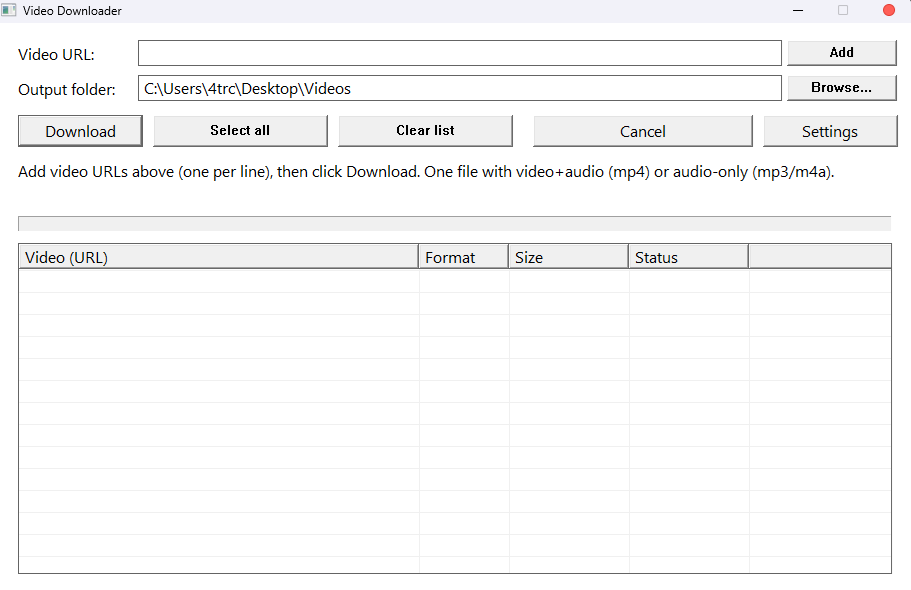

# Video Downloader

> **Paste a link. Pick a quality. Get one clean file.**

A lightweight, local-first Windows tool for downloading videos from **YouTube and 1000+ other sites**, powered by **yt-dlp**. Now at **v1.0.0**: batch queue, merged video+audio output, and a fully native Win32 interface.

Video Downloader combines the power of yt-dlp with a clear graphical interface, checkbox-based batch selection, a live progress bar, and a classic square look that renders identically on every Windows machine.

## Why use it?

Command-line downloaders are powerful but unfriendly: remembering flags, merging streams by hand, parsing percent output. Video Downloader gives you one simple workflow — paste links, check what you want, click Download — while yt-dlp and ffmpeg do the heavy lifting in the background.

## Highlights

- Downloads from YouTube and every site supported by [yt-dlp](https://github.com/yt-dlp/yt-dlp) (1000+ services).
- **Merged output**: video and audio are combined into a single playable MP4 file automatically (ffmpeg is bundled). No more separate `.f395.mp4` + `.f251.webm` files.
- Audio-only mode: extract MP3 (192 kbps) or M4A from any video.
- Batch queue: paste one URL per line — each link becomes a row with its own checkbox, format, size, and status.
- Live progress bar parsed from yt-dlp output, plus per-item Size and Status columns.
- Quality presets: Best, 1080p, 720p, 480p, 360p.
- Drag & drop links (or `.url`/text files) onto the window to fill the queue.
- Checkbox selection with **Select all** — download everything or only picked items.
- **Cancel** button stops the running download instantly.
- Output folder picker with a sensible default (`Desktop\Videos`), auto-created if missing.
- Keyboard shortcuts: Ctrl+S download, Ctrl+E add, Ctrl+O browse, Ctrl+L select all, Ctrl+K clear.
- Interface languages: **English, Polish, Chinese, German, Russian** — switchable in Settings.
- Classic Win32 look (no visual styles dependency) — identical square buttons and progress bar on Windows 7 through 11.
- Processes URLs locally; nothing is sent anywhere except to the video site itself.

## Supported sites

Anything yt-dlp supports, including:

| Category | Examples |
|---|---|
| Video platforms | YouTube, YouTube Music, TikTok, Vimeo, Dailymotion, Twitch |
| Social media | Twitter/X, Instagram, Facebook, Reddit |
| Streaming | BBC iPlayer, SoundCloud, Bandcamp |
| ...and more | [Full list of 1000+ supported sites](https://github.com/yt-dlp/yt-dlp/blob/master/supportedsites.md) |

## Quick start

1. Run `bin/Pobieracz.exe` (prebuilt 64-bit binary — no installation needed).
2. Paste a video URL into the **Video URL** field and click **Add** (one link per line for batches).
3. Choose the output folder (**Browse...**) — defaults to `Desktop\Videos`.
4. Optionally pick **Settings → Format** (mp4/mp3/m4a) and **Settings → Quality** (Best/1080p/720p/480p/360p).
5. Check the items you want with the checkboxes.
6. Click **Download** (or press Ctrl+S).
7. Watch the progress bar; each row shows size and status (`Ready → Downloading... → Done`).
8. Click **Cancel** any time to stop the running download.

Finished files land in the output folder as `VideoTitle.mp4` — one clean file with video and audio.

## Output example

```text
Desktop\Videos\
├── Me at the zoo.mp4              <- video + audio merged into one file
├── Big Buck Bunny.mp4
└── Never Gonna Give You Up.mp3    <- audio-only extraction (Settings -> Format)
```

## Screenshots



## Requirements

- Windows 10 or newer recommended (works on Windows 7+).
- Windows x86-64.
- Internet connection for downloading (obviously).
- Nothing else — `yt-dlp.exe` and `ffmpeg.exe` are bundled in `bin/`.

## Build

Video Downloader is a native Win32 C++ application built with MinGW-w64 — the exact same toolchain and flags as Resource Extractor. The easiest way:

```powershell
powershell -ExecutionPolicy Bypass -File build.ps1
# or with a specific compiler:
powershell -ExecutionPolicy Bypass -File build.ps1 -Compiler "C:\msys64\ucrt64\bin\g++.exe"
```

The script compiles `app.rc` (version info + manifest) with `windres` and links everything statically, so the resulting EXE runs standalone. Output lands in `bin/`.

Manual build with MinGW-w64:

```bash
windres -i app.rc -O coff -o app_res.o
g++ -std=c++17 -O2 -municode -mwindows \
  pobieracz.cpp app_res.o -o bin/Pobieracz.exe \
  -lcomdlg32 -lshell32 -lole32 -lcomctl32 -lgdi32 -lz \
  -static-libgcc -static-libstdc++ -static
```

## Bundling yt-dlp and ffmpeg

The downloader looks for its engines next to the EXE first, then in `PATH`:

```
bin\
├── Pobieracz.exe    <- the app (this repo builds it)
├── yt-dlp.exe       <- download engine (get from yt-dlp releases)
└── ffmpeg.exe       <- video+audio merging, mp3/m4a extraction (get from BtbN or gyan.dev builds)
```

`yt-dlp.exe` updates itself when you re-download it from the official releases. ffmpeg only needs to be replaced occasionally.

## Safety

Video Downloader only talks to the video sites you paste links for. It does not collect telemetry, does not phone home, and stores nothing outside the output folder you choose.

Only download content you own or are authorized to download. Respect the terms of service of the platforms you use and local copyright law. The tool is not intended to bypass access controls or DRM.

## License

MIT — see [LICENSE](LICENSE).

## Links

- **Latest release:** [v1.0.0](../../releases/tag/v1.0.0)
- Powered by [yt-dlp](https://github.com/yt-dlp/yt-dlp) and [FFmpeg](https://ffmpeg.org)
